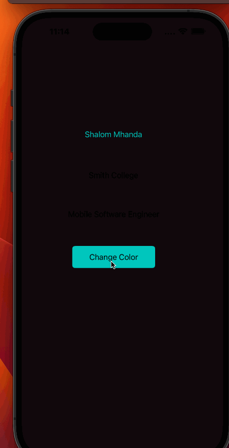

# Prework - *Change Background Color*

Submitted by: **Shalom Mhanda**

**iOSCodePath** is an app that changes the background color to a random color each time the change color button is clicked. 

Time spent: **4** hours spent in total

## Required Features

The following **required** functionality is completed:

- [X] Users see a screen with three labels and a button
- [X] Tapping the button changes the screen color to a random color
 
## Video Walkthrough

.

## App Brainstorming (Step 4)

### Favorite Apps
#### YouTube
- Personalized recommendations
- Availability of short videos (YouTube shorts) and long videos
- Ease of sharing video links

#### Weather App 
- Display of weather conditions at the top of the screen e.g display of snow falling if there is snow outside
- Use of icons to summarize the weather for a particular day e.g a cloud icon representing a cloudy day

#### Calm
- Calm sounds are played as soon as you open the app and as you are navigating the app
- Nature colors on the UI
- A few categories of content make it easy to maneuver

### Project Plan
#### Career Discovery App
The Career Discovery app is your one-stop shop for all career advice. Our app predicts careers that capture your values and interests through a questionnaire. If you already know what career you want to pursue, you can skip the quiz and enter your desired career. We’ll ask you what level you’re at (0-2 years experience, 2-5 years experience, 5+ years of experience) to provide you with resources that will be useful to you. These resources include tips on how to succeed in your career, actionable steps you can take, and common resources for your career path. Our app provides you with all the resources you need in one place or directs you to them. The Career Discovery app is designed to be user-specific and meet the needs of each particular user through personalized recommendations. It’s also designed to be easy to follow and less overwhelming.

## Notes
I faced challenges opening the storyboard file. Following the provided GIF helped me find a way to to connect the button to the code.

## License

    Copyright [2023] [Shalom Mhanda]

    Licensed under the Apache License, Version 2.0 (the "License");
    you may not use this file except in compliance with the License.
    You may obtain a copy of the License at

        http://www.apache.org/licenses/LICENSE-2.0

    Unless required by applicable law or agreed to in writing, software
    distributed under the License is distributed on an "AS IS" BASIS,
    WITHOUT WARRANTIES OR CONDITIONS OF ANY KIND, either express or implied.
    See the License for the specific language governing permissions and
    limitations under the License.
